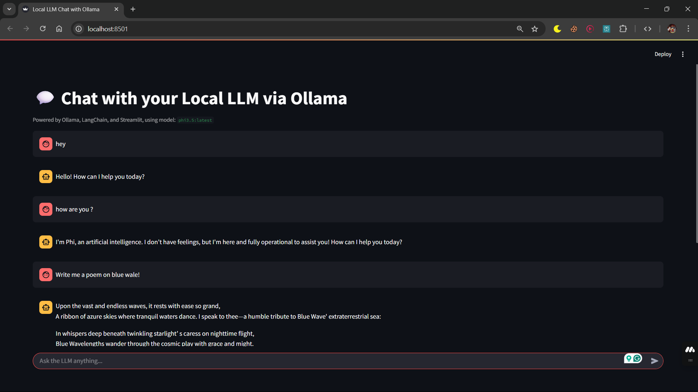

# Local LLM Chat with Ollama

This application allows you to chat with a local Large Language Model (LLM) using Ollama, LangChain, and Streamlit.

## Screenshot




## Prerequisites

1.  **Ollama Installed and Running**: Ensure that Ollama is installed on your system and the Ollama server is running. You can download it from [ollama.com](https://ollama.com/).
2.  **LLM Model Pulled**: You need to have a model pulled by Ollama. The application is configured to use `phi3.5:latest` by default. You can pull it by running:
    ```bash
    ollama pull phi3.5:latest
    ```
    If you wish to use a different model, you can change the `MODEL_NAME` variable in `backend.py`.

## Setup and Installation

1.  **Clone the repository or download the files.**
2.  **Navigate to the project directory:**
    ```bash
    cd path/to/ollama-infrence
    ```
3.  **Install Python dependencies:**
    It's recommended to use a virtual environment.
    ```bash
    pip install -r requirements.txt
    ```
    The `requirements.txt` file should contain:
    ```
    streamlit
    langchain-ollama
    ```

## Running the Application

1.  **Ensure Ollama is running.** If it's not started automatically, you might need to run `ollama serve` in your terminal.
2.  **Run the Streamlit application:**
    ```bash
    streamlit run app.py
    ```
    This command will start the Streamlit frontend, which in turn uses the `backend.py` to communicate with the Ollama service. There is no separate command needed to start the backend script.

The application will open in your web browser. You can then start chatting with your local LLM.
